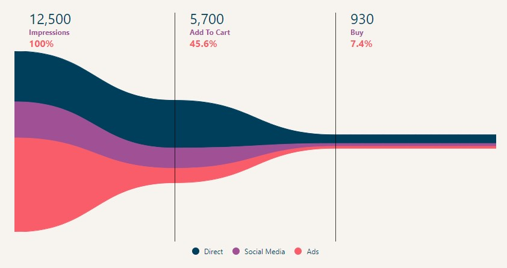

# Funnel Graph


[](https://coveralls.io/github/trutoo/funnel-graph?branch=main) [](https://github.com/trutoo/funnel-graph/releases) [](https://www.npmjs.com/package/@trutoo/funnel-graph) [](https://bundlephobia.com/result?p=@trutoo/funnel-graph) [](https://github.com/trutoo/funnel-graph/blob/main/LICENSE)

Funnel Graph is a rewrite of [@greghub](https://github.com/greghub)/[FunnelGraph.js](https://github.com/greghub/funnel-graph-js) to TypeScript with improvements such as; types, simplified styling, css animated paths, new basic look, etc... However, it still retains all of the original features include generating horizontal and vertical funnel charts, applying solid colors and gradients, and the possibility to generate a two-dimensional funnel chart.



## Installation

Either add the Trutoo GitHub Package registry to your `.npmrc`

```ini
@trutoo:registry=https://npm.pkg.github.com/trutoo
```

or install using the registry flag

```bash
npm install @trutoo/funnel-graph --registry=https://npm.pkg.github.com/trutoo
```

or install from the [npm registry @trutoo/funnel-graph](https://www.npmjs.com/package/@trutoo/funnel-graph)

```bash
npm install @trutoo/funnel-graph
```

Then import the `FunnelGraph` class to create a graph.

```javascript
import { FunnelGraph } from '@trutoo/funnel-graph';
// or
const { FunnelGraph } = require('@trutoo/funnel-graph');

const myFunnelGraph = new FunnelGraph({
  container: '.funnel', // or reference to an Element
  data: {
    labels: ['Impressions', 'Add To Cart', 'Buy'],
    colors: ['orange', 'red'],
    values: [12000, 5700, 360],
  },
});
myFunnelGraph.draw();
```

or using the UMD module and instance.

```html
<script src="https://unpkg.com/@trutoo/funnel-graph@latest/dist/index.umd.min.js"></script>
<script>
  const myFunnelGraph = new fg.FunnelGraph({
    container: '.funnel', // or reference to an Element
    data: {
      labels: ['Impressions', 'Add To Cart', 'Buy'],
      colors: ['orange', 'red'],
      values: [12000, 5700, 360],
    },
  });
  myFunnelGraph.draw();
</script>
```
